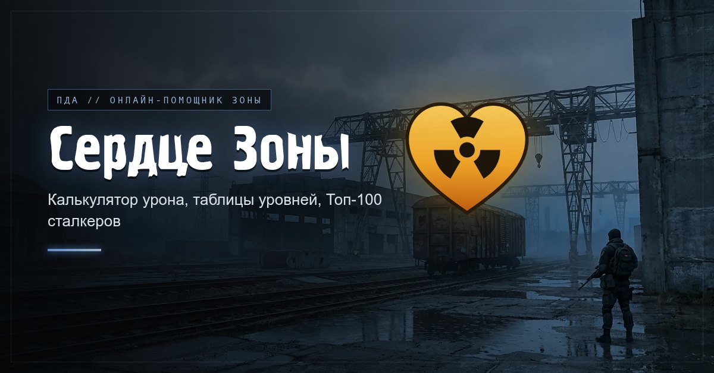

# Сердце Зоны - сайт-помощник

**Сайт: https://heart-of-the-zone.ru/**

Фан-сайт для игроков в «Сердце Зоны».

Помогает посчитать урон, спланировать прокачку и посмотреть рейтинг игроков. Это неофициальный сайт, сделанный игроком для игроков.

## Калькулятор урона

- Показывает урон каждого оружия: гранаты, гранатомёта, гаусса, ножа, пистолета и автомата.
- Учитывает уровень персонажа, снаряжение и таланты и показывает, сколько урона дала каждая из этих частей.
- **Древо талантов**: распределяйте очки и сразу смотрите, как меняется урон.
- **Расчёт по жетонам**: сколько урона выйдет из ваших жетонов, сколько жетонов нужно на босса и какое оружие выгоднее всего.
- **Бонусы снаряжения**: что даёт каждый комплект и каждая вещь.
- **Ссылка на билд**: отправьте свою сборку другу одной ссылкой.
- **Сравнение**: вставьте ссылку на чужой билд и сравните его со своим.
- **Мои билды**: несколько сохранённых билдов со своими названиями, переключение в один клик, любой билд можно сохранить по ссылке и поделиться ссылкой на любой слот.

## Информация

- Сколько стоит улучшить талант на каждом уровне.
- Сколько опыта нужно для следующего уровня персонажа и ПДА.
- Награды за задания на каждой локации и где выгоднее всего тратить энергию.

## Топ-100

- Рейтинг лучших игроков в семи разделах: репутация, боссы, тайники, таланты, коллекции, экспедиции и защита лагеря.
- Поиск по нику и выбор группировки.
- Кто поднялся или опустился в рейтинге (с прошлого обновления, за сутки, за неделю) и кто попал в него впервые.
- Карточка игрока по клику на ник; ссылка на карточку - `/p/<id>`, в мессенджерах она показывает превью «Личное дело».
- **Моё место**: отметьте себя (поиск по нику или кнопка «Это я» в карточке) - ваша строка подсвечивается во всех рейтингах, кнопка «К моему месту» прокручивает к ней, а на главной видны ваши места во всех семи рейтингах и как они изменились с прошлого обновления.
- **Сравнение игроков** (кнопка «Сравнить игроков» в Топ-100 и «Сравнить» в карточке игрока): два «Личных дела» рядом по всем рейтингам, кто впереди и на сколько; ссылка вида `/compare?a=<id>&b=<id>`.
- Рейтинг обновляется автоматически раз в сутки, дата обновления указана вверху страницы.

## Гайды

- Гайды пишут сами игроки: кнопка «Отправить свой гайд» на странице гайдов, подпись - ник автора (если ник есть в Топ-100, подпись ведёт на карточку игрока).
- Гайд с картинками приходит в репозиторий pull request'ом и появляется на сайте только после проверки (Merge). Перед публикацией текст и подпись можно поправить прямо в pull request.
- Файлы гайда: `guides/<адрес>/index.md` и картинки рядом, страница - `/guide/<адрес>`. Приём формы - функция Yandex Cloud, настройка и проверка гайдов - в `yandex/README.md`.

## Удобство

- Сайт удобно открывать и на компьютере, и на телефоне.
- Семь оформлений в цветах группировок: Наёмники, Долг, Свобода, Учёные, Монолит, Рассвет и Вольные сталкеры.
- Живая главная страница: по фону плывёт туман, летает пепел и иногда вспыхивает аномалия, а при первом заходе встречает объёмное «Сердце Зоны»: оно бьётся, волны от ударов складываются в знак радиации, и сердце улетает в угол, становясь логотипом сайта. На слабых устройствах и в режиме экономии трафика фон остаётся обычным, чтобы страница открывалась быстрее.
- Иконки меню оживают при наведении.
- Сайт запоминает ваш уровень, снаряжение, таланты и выбранное оформление, так что при следующем заходе всё останется на месте.
- Сайт можно установить на телефон или компьютер как приложение, открытые раньше разделы работают без интернета (Топ-100 - с данными последнего захода).

by Sof
