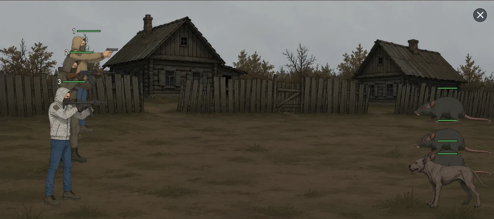
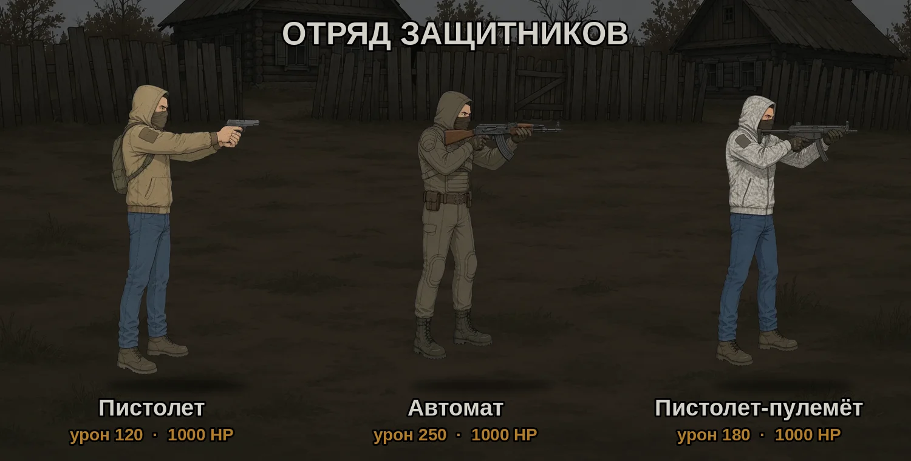
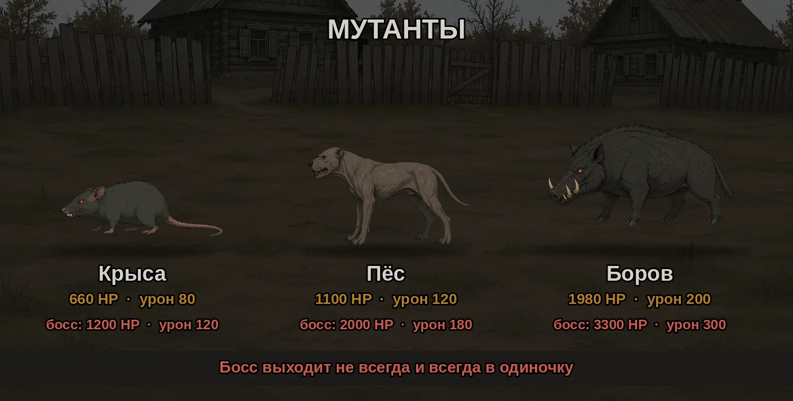
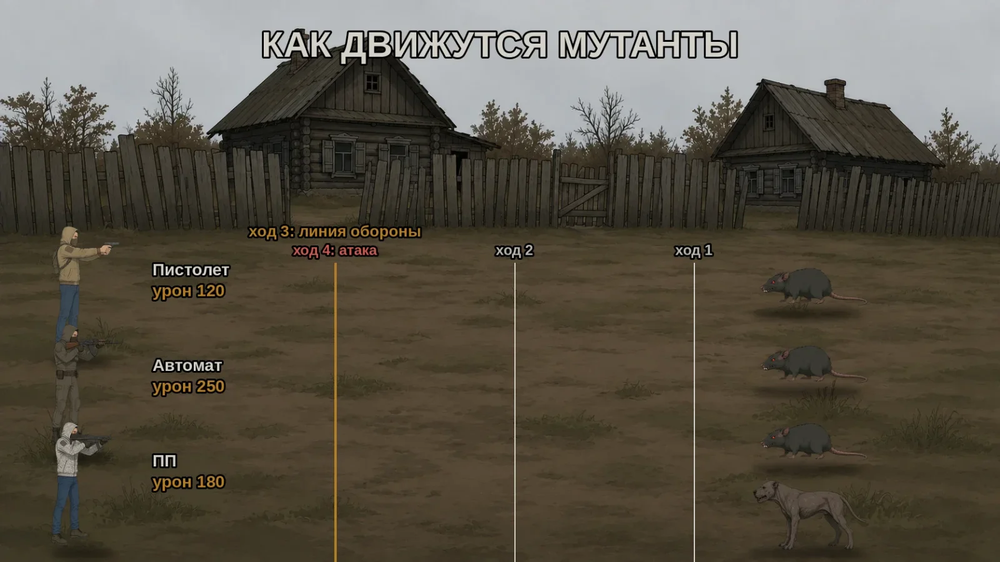
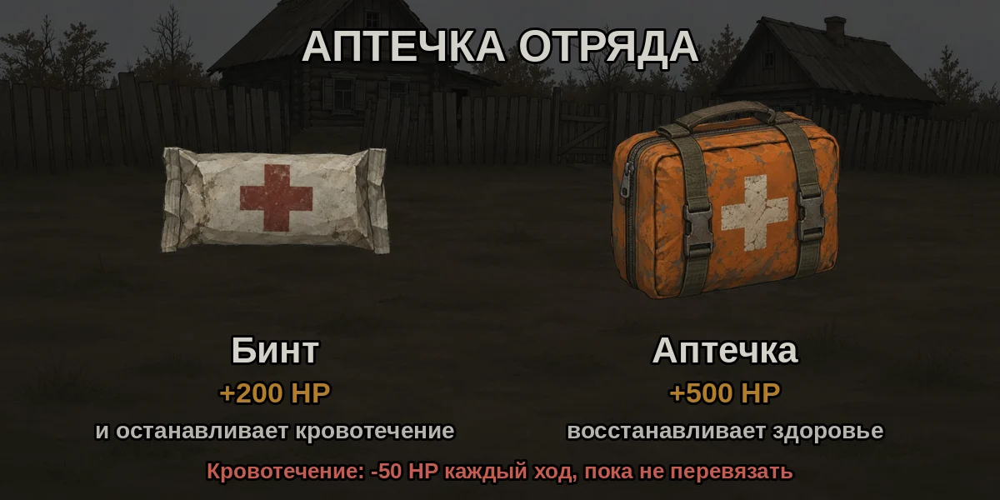

Оборона лагеря - пошаговый бой: три сталкера под вашим командованием отбивают три волны мутантов, а иногда ещё и босса. Состав волн всегда одинаковый, поэтому бой можно просчитать заранее. Ниже - цифры, порядок целей и пошаговый план, при котором отряд получает минимум урона и обходится почти без аптечек.

## Когда открывается

- Пункт **«Нужна помощь!»** загорается в списке задач на главном экране **3 раза в сутки: в 7:00, 13:00 и 19:00 по Москве**.
- На отклик даётся **2 часа**, потом пункт пропадает до следующего вызова.
- Начатый бой сохраняется: можно выйти и вернуться через **«Продолжить»**.

## Отряд

- **Пистолет** - 120 урона, 1000 здоровья.
- **Автомат** - 250 урона, 1000 здоровья.
- **Пистолет-пулемёт (ПП)** - 180 урона, 1000 здоровья.

Залп всего отряда - **550 урона**. Критический выстрел наносит **двойной урон**.

## Мутанты и волны

- **Крыса** - 660 здоровья, 80 урона.
- **Пёс** - 1100 здоровья, 120 урона.
- **Боров** - 1980 здоровья, 200 урона.

Состав волн всегда одинаковый:

1. **Волна 1** - 1 пёс и 3 крысы.
2. **Волна 2** - 2 пса и 2 крысы.
3. **Волна 3** - боров, 2 пса и 1 крыса.

После третьей волны **может** выйти босс - это случайность, он бывает не всегда. Босс всегда выходит один:

- **Босс-крыса** - 1200 здоровья, 120 урона.
- **Босс-пёс** - 2000 здоровья, 180 урона.
- **Босс-боров** - 3300 здоровья, 300 урона.

Мутанты за 3 хода добираются до сталкеров, а **с 4-го хода атакуют**. В каждом ходу **первыми стреляют сталкеры**, поэтому у отряда есть 4 залпа до первого удара.

Атака может вызвать **кровотечение**: **-50 здоровья каждый ход**, пока его не перевязать.

Здоровье между волнами **не восстанавливается**, кровотечения переходят в следующую волну.

## Как проходит ход

1. Нажмите на кнопку бойца внизу экрана.
2. Выберите **«Атака»** и нажмите на мутанта - цель назначится сразу. Также можно **«Использовать предмет»** или сделать **«Пропуск»**.
3. Назначьте действия всем бойцам и нажмите **«Выполнить ход»**.

Действия сохраняются на следующий ход. Если цель погибла, боец сам переключится на ближайшего мутанта, поэтому после каждого хода проверяйте, кто куда стреляет.

## Главное правило: без лишнего урона

Мутант бьёт, пока жив, поэтому важно не только **кого** убивать, но и не тратить выстрелы на уже добитых. Полезные числа:

- **Пёс** - ровно 2 залпа отряда (550 + 550 = 1100).
- **Крыса** - залп отряда оставляет её с 110 здоровья. Добить хватит одного **пистолета**, а автомат и ПП в этот ход уже стреляют в следующую цель.
- **Боров** - 3 залпа, и останется 330. Добивают **автомат + пистолет** (370), а **ПП** в этот ход уже стреляет в следующую цель.

## Порядок целей

- **Волна 1:** порядок почти не влияет на урон. Удобнее начать с пса: он умирает за 2 хода, до своей первой атаки.
- **Волна 2:** сначала псы, потом крысы. Если начать с крыс, псы успеют ударить, и урона будет больше.
- **Волна 3:** сначала **боров**, потом **крыса**, потом псы. Если стрелять по борову с первого хода, он умирает на 4-м ходу - **до своей первой атаки**. Крыса бьёт почти как пёс (80 против 120), а здоровья у неё в 1,7 раза меньше. На 4-м ходу ПП уже снимает с неё 180, и на 5-м ходу её добивает один залп. Поэтому её выгодно убрать следующей.

Для сравнения, урон в третьей волне: боров → крыса → псы - 1040, боров → псы → крыса - 1120, псы → боров → крыса - 1200. Начинать с крысы ещё хуже - 1440-1600.

## Пошаговый план

**Волна 1 (1 пёс, 3 крысы)**

1. Ходы 1-2: все в пса - он умирает до своей первой атаки.
2. Ход 3: все в крысу 1.
3. Ход 4: пистолет добивает крысу 1, автомат и ПП - в крысу 2.
4. Ход 5: пистолет и ПП добивают крысу 2, автомат - в крысу 3.
5. Ход 6: все в крысу 3.

Около 240 урона за волну.

**Волна 2 (2 пса, 2 крысы)**

1. Ходы 1-2: все в пса 1.
2. Ходы 3-4: все в пса 2 - он умирает до своей первой атаки.
3. Ход 5: все в крысу 1.
4. Ход 6: пистолет добивает крысу 1, автомат и ПП - в крысу 2.
5. Ход 7: все в крысу 2.

Около 400 урона за волну.

**Волна 3 (боров, 2 пса, крыса)**

1. Ходы 1-3: все в борова.
2. Ход 4: автомат и пистолет добивают борова, ПП - в крысу.
3. Ход 5: все в крысу - она умирает.
4. Ходы 6-7: все в пса 1.
5. Ходы 8-9: все в пса 2.

Около 1040 урона за волну - это самая тяжёлая часть обороны.

**Босс**

- **Босс-крыса:** 2 залпа, на 3-м ходу хватит одного пистолета. Умирает до атаки.
- **Босс-пёс:** 3 залпа, на 4-м ходу добивают автомат и пистолет. Умирает до атаки.
- **Босс-боров:** все стреляют 6 ходов подряд (3300 - ровно 6 залпов). Успеет ударить 2 раза - 600 урона.

Криты сокращают бой. Если цель умерла раньше плана, сразу переведите бойцов на следующую.

## Аптечки и бинты

- **Бинт** - останавливает кровотечение и лечит **+200**.
- **Аптечка** - лечит **+500**.

Их мало, поэтому тратьте только в крайнем случае. При игре по плану отряд за всю оборону получает от мутантов около 1680 урона на троих без босса и до 2280 с боссом-боровом, а запас здоровья - 3000. Если урон распределяется между бойцами, отряд дойдёт до конца без аптечек, но запас будет небольшим.

**Кровотечение - главная угроза.** Вся оборона по плану длится около 22 ходов без босса и до 28 с боссом-боровом. Кровотечение, полученное в первой волне, к концу снимет 900-1200 здоровья - почти целого бойца.

- **Кровотечение в волне 1 или 2** - перевязывайте сразу. Один бинт сэкономит больше здоровья, чем даёт аптечка.
- **Кровотечение в волне 3 или у босса** - посчитайте: 50 × оставшиеся ходы. Если у бойца хватает здоровья с запасом на это и на удары мутантов, бинт можно не тратить.
- **Нужно и лечить, и снять кровотечение** - сначала бинт (+200 и без потерь по 50 за ход), аптечку - только если этого мало.

Аптечку стоит использовать, только если боец может погибнуть в следующем ходу:

- в волне 3 все мутанты вместе бьют максимум на 520 за ход, после смерти борова - на 320, после крысы - на 240;
- босс-боров бьёт на 300 за ход.

К этим числам прибавьте 50, если боец кровоточит. Если здоровья у бойца больше, пусть стреляет. Потеря бойца опаснее потраченной аптечки: без автомата отряд будет убивать босса-борова 11 ходов вместо 6. В конце обороны бинт нужен, только если кровотечение у бойца с малым запасом здоровья..

## Награды

Победа - экран **«Лагерь защищен»** и кнопка **«Получить награду»**:

- **с боссом:** 150 опыта, 100 патронов, 25 репутации, 5 жетонов;
- **без босса:** 100 опыта, 100 патронов, 25 репутации, 3 жетона.

Если отряд погиб - **«Лагерь уничтожен»**, награды нет.
