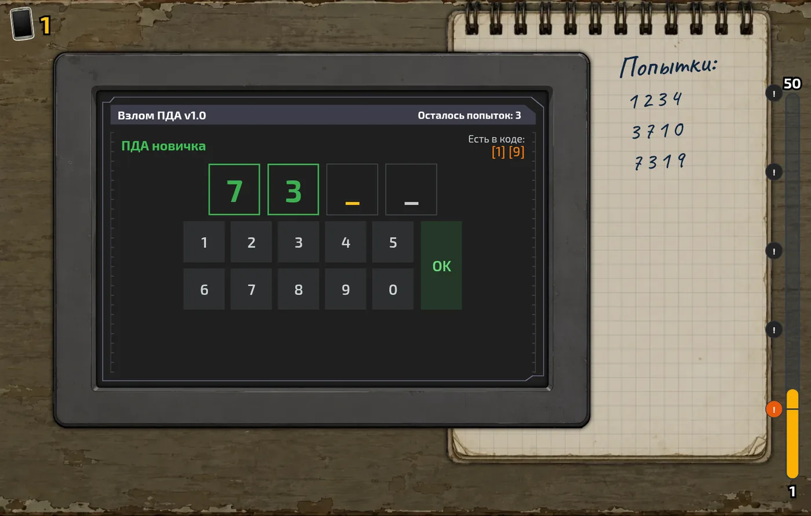
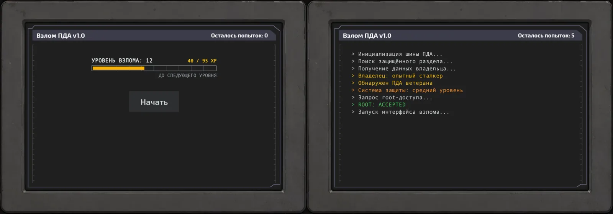
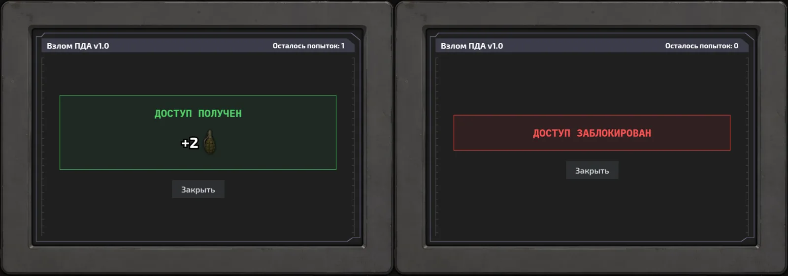
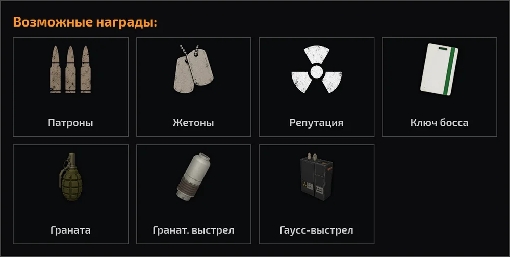

«Взлом ПДА» - ежедневная мини-игра в духе «Быков и коров». Тебе попадает чужой ПДА с цифровым защитным кодом, и его нужно подобрать по подсказкам, пока не закончились попытки. Открыл - получаешь награду, не успел - доступ блокируется.

## Где найти и сколько можно играть

Мини-игра находится в разделе мини-игр. Каждый день ты получаешь ПДА для взлома. Сколько ПДА доступно прямо сейчас, показывает счётчик с иконкой ПДА в левом верхнем углу. Дополнительные взломы иногда выпадают в наградах - они называются «Взломы PDA». Пока счётчик на нуле, кнопка **Начать** неактивна.

## Какие бывают ПДА

После нажатия **Начать** терминал определяет, чей ПДА тебе попался. Типов три:

- **ПДА новичка** (зелёный) - код из **4 цифр**, владелец «сталкер-новичок», защита «низкий уровень»;
- **ПДА ветерана** (жёлтый) - код из **5 цифр**, владелец «опытный сталкер», защита «средний уровень»;
- **ПДА учёного** (синий) - код из **6 цифр**, владелец «научный сотрудник», защита «высокий уровень».

Чем ценнее ПДА, тем длиннее его защитный код и тем лучше возможная награда. Тип выпадает случайно, а на 30 уровне взлома шанс получить более редкий ПДА растёт.

## Правила

1. Код состоит из цифр от 0 до 9: у ПДА новичка 4 цифры, у ветерана 5, у учёного 6. Количество ячеек на экране равно длине кода.
2. Вводи цифры на клавиатуре ПДА. Курсор (жёлтая мигающая ячейка) сам переходит к следующей пустой ячейке. Чтобы исправить цифру, просто нажми на нужную ячейку и введи другую - отдельной кнопки стирания нет.
3. Когда заполнены все ячейки, нажми **OK**. Одна проверка - одна попытка, остаток показан вверху: «Осталось попыток».
4. **Цифры на своих местах** закрепляются: ячейка становится зелёной, и в следующих попытках её уже не нужно вводить - заполняешь только свободные ячейки.
5. **Цифры не на своих местах** показываются справа вверху в подсказке «Есть в коде:», например `[1] [9]`. Эти цифры в коде есть, но стоят на другой позиции.
6. Все введённые комбинации записываются в блокнот справа - «Попытки:», так проще не повторяться.
7. Угадал весь код - «ДОСТУП ПОЛУЧЕН» и награда. Закончились попытки - «ДОСТУП ЗАБЛОКИРОВАН».

Главное отличие от классических «Быков и коров»: игра не просто называет число «быков», а сразу закрепляет угаданные цифры на своих местах и показывает, какие именно цифры стоят не там. Поэтому код обычно открывается за несколько попыток.

## Пример

Допустим, у ПДА новичка код `7391`.

- Попытка `1234`: на своих местах ничего, «Есть в коде: [1] [3]». Значит, в коде есть 1 и 3, а 2 и 4 нет.
- Попытка `3710`: снова ничего не закрепилось, «Есть в коде: [1] [3] [7]». Узнали ещё и про 7, а 0 в коде нет.
- Попытка `7319`: 7 и 3 закрепились зелёным, «Есть в коде: [1] [9]». Осталось поменять 1 и 9 местами.
- Попытка `__91` (7 и 3 уже стоят) - доступ получен.

## Тактика

- **Первые попытки - разведка.** Вводи разные цифры, которые ещё не проверял: например (если ПДА новичка) `1234`, затем `5678`, затем `90` и еще парочку из тех цифр, места которых ты не угадал ранее.
- **Двигай найденные цифры.** Если цифра в подсказке «Есть в коде», в следующей попытке ставь её на другое место - туда, где она ещё не стояла.
- **Не трать ячейки на отсеянные цифры.** Если цифра не закрепилась и не попала в подсказку, её нет в коде - больше её не вводи (кроме случаев, когда нечем заполнить ячейку).
- **Смотри в блокнот.** Записанные попытки помогают не ставить цифру туда, где она уже не подошла.
- **Последнюю попытку трать только на уверенный вариант.** Если вариантов два, а попытка одна, выбери тот, что лучше сходится со всеми прошлыми подсказками.

## Награды

За успешный взлом выдаётся одна награда. Возможные варианты:

- патроны, жетоны или репутация;
- **Ключ босса** - зелёный, нужен для боссов (подробнее на вкладке [«Боссы»](/info));
- удары по боссу: **граната**, **гранатомётный выстрел** и **гаусс-выстрел**.

Чем ценнее ПДА, тем лучше возможная награда. С 50 уровня взлома награда может удвоиться.

## Уровень взлома

За завершённый взлом начисляется опыт взлома:

- ПДА новичка - 20 опыта;
- ПДА ветерана - 40 опыта;
- ПДА учёного - 100 опыта.

Текущий уровень и опыт до следующего видны на стартовом экране («УРОВЕНЬ ВЗЛОМА»), а справа на экране - шкала от 1 до 50 с отметками «!». Нажми на отметку, чтобы увидеть бонус уровня. Максимальный уровень - 50, всего до него нужно 8085 опыта. Сколько опыта нужно на каждый уровень, можно посмотреть на странице [«Информация»](/info), вкладка «ПДА» в «Прогрессе по уровням».

Каждые десять уровней открывается новое усиление:

- **10 уровень** - каждый ПДА получает одну дополнительную попытку взлома;
- **20 уровень** - в начале взлома известна одна цифра, которая есть в коде;
- **30 уровень** - растёт шанс выпадения более редкого ПДА;
- **40 уровень** - в начале взлома известны две цифры, которые есть в коде;
- **50 уровень** - появляется шанс удвоить любую награду за успешный взлом.

> Стартовые подсказки с 20 и 40 уровня появляются в поле «Есть в коде» ещё до первой попытки - начинай перебор с них.
